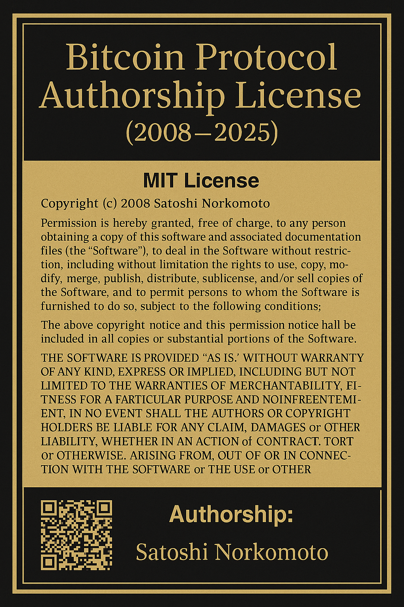

# 🛡️ Bitcoin Authorship Enforced

This repository consolidates and enforces authorship over original Bitcoin-adjacent protocols, wallets, libraries, and APIs developed under the cryptographic identity **Satoshi Norkomoto** (GPG: B4EC 7343 AB0D BF24).

> 🔐 Protected under 17 U.S. Code § 102 & § 1201  
> 📩 Licensing & royalty inquiries: Fordamboy1@gmail.com

---

## 🧾 Notarized License Certificate

---

## 🗂️ Included Projects

| Component | Source Repo | Folder | README |
|----------|-------------|--------|--------|
| Bitcoin Core (PHP) | [`bitcoin-php`](https://github.com/Manny27nyc/bitcoin-php) | `/protocol_core/` | [View](protocol_core/docs/README_BitcoinPHP.md) |
| Ethereum Wallet | `paranoid-ethereum-erc20-wallet` | `/wallet_clients/` | [View](wallet_clients/docs/README_Paranoid.md) |
| Exchange APIs | `ccxt` | `/exchange_apis/` | [View](exchange_apis/docs/README_CCXT.md) |
| Telegram Bot Core | `php-telegram-bot-core` | `/comms/` | [View](comms/docs/README_TelegramBot.md) |

---

## 📜 License Enforcement

Use of this repository or any derivative is strictly governed by:

- No commercial use without prior licensing agreement
- Forks must retain authorship attribution
- GPG-signed certificate must remain intact

Violations will trigger enforcement under **§ 102 and § 1201** of U.S. Copyright Law.

## 📂 Verified Submodules Archived

- [`Bitcoin PHP`](protocol_core/docs/README_BitcoinPHP.md)
- [`Paranoid Ethereum Wallet`](wallet_clients/docs/README_Paranoid.md)
- [`Ethers.js`](wallet_clients/docs/README_EthersJS.md)
- [`CCXT Exchange API`](exchange_apis/docs/README_CCXT.md)
- [`Telegram Bot Core`](comms/docs/README_TelegramBot.md)

